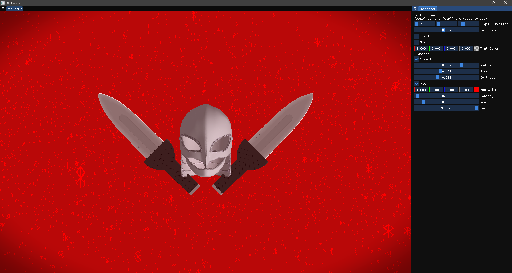
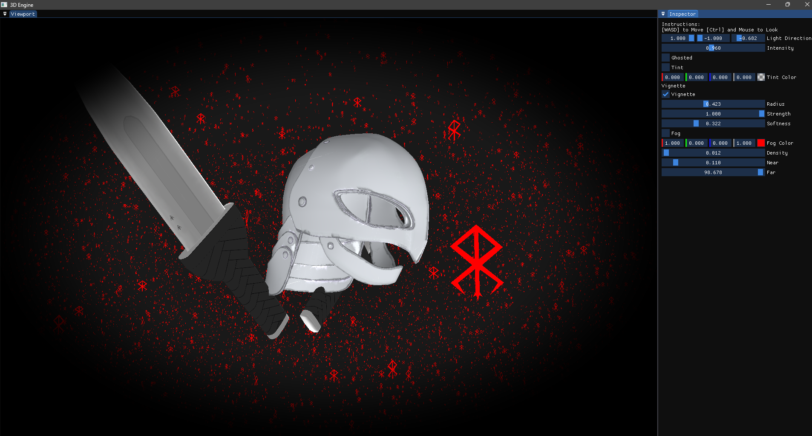
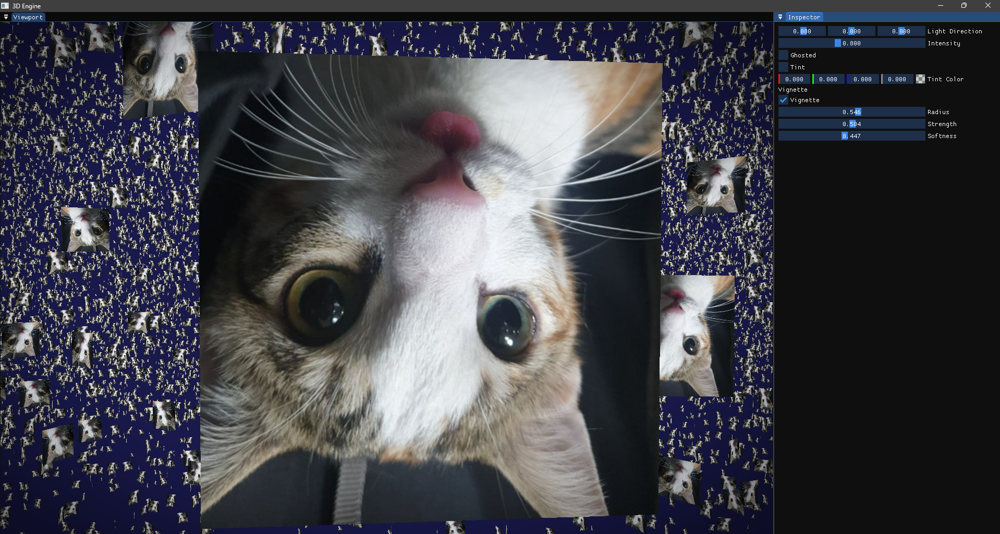

# C++ OpenGL Model Viewer

A C++ / OpenGL model viewer / mini-engine with an editor layer (ImGui), model loading (Assimp), framebuffer post-processing, and a component-based scene system.

## Features

- Editor UI using ImGui (viewport + tools)
- Model loading via Assimp
- Framebuffer rendering + post-processing pipeline
- Component-based scene / GameObject architecture
- GPU instancing for drawing many objects efficiently

## Acknowledgements

This project was inspired by The Cherno’s _Hazel_ engine series. I followed parts of the series early on, then extended the engine with my own architecture and features (framebuffer post-processing, editor UI, model loading, instancing, etc.).

## Repository Layout

- `Core/` — engine code
- `App/` — application / editor / sandbox
- `Scripts/` — build + project generation scripts (Windows & Linux)
- `Vendor/` — third-party dependencies and tools (external code)

> Note: `Vendor/` contains external libraries and tooling. Each dependency keeps its own license (see the license files inside `Vendor/` where applicable).

## Getting Started

1. Run `Build-assimp` in the scripts folder
2. Run `Setup` in the scripts folder
3. Make sure the `res` folder is Next to `App` after you build for release.
4. Builds go to the folder `Binaries/[platform]/[Debug/Release]/App` make sure you have `res` next to this

